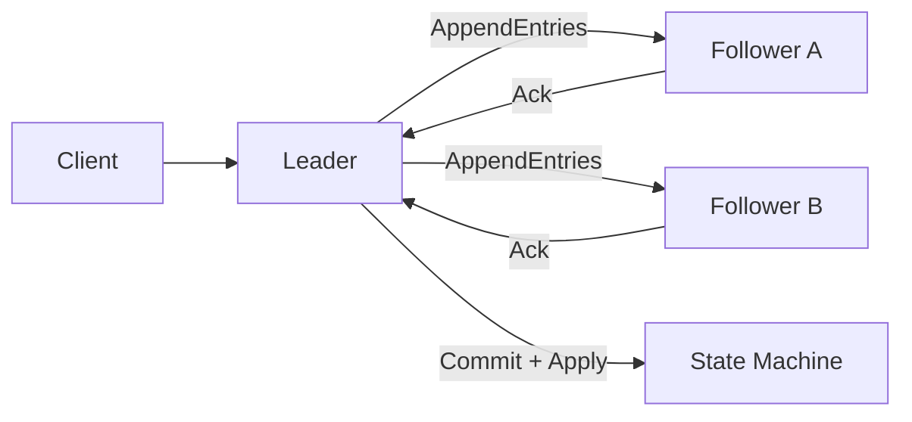

# balsa-jraft

**A practical Raft implementation in pure Java 21 with zero runtime deps**

**Fast enough for real use, simple enough that I can still debug it before coffee**

[New to Raft?](#new-to-raft) •
[Quick Start](#quick-start) •
[Benchmark](#benchmark) •
[Documentation](#library-usage) •
[Contributing](#contributing)


---

## Why Balsa?

This repo exists to help people learn Raft by reading real code not just papers.

I wanted a Raft library I could read in one sitting without opening five tabs and pretending I understood them all.

This code is opinionated and intentionally boring in hot paths.

When distributed systems get weird boring code wins.

| Feature | Balsa | Typical Impl |
|---------|:------:|:---------------------:|
| Runtime dependencies | Zero | Many |
| Concurrency model | Virtual threads | Thread pools / callbacks |
| Durability | `fsync` per commit | Often buffered in benchmarks |
| Deployment | Single JAR | Fat stack |

---

## New to Raft?

If you have never seen Raft before start here. Watch one then come back and read the code. It will make way more sense.

**Watch first** (20 min)
- [Designing for Understandability: The Raft Consensus Algorithm](https://www.youtube.com/results?search_query=Designing+for+Understandability+The+Raft+Consensus+Algorithm)

**Read second**
- [In Search of an Understandable Consensus Algorithm](https://raft.github.io/raft.pdf) (the original paper)

**Go deeper**
- [Consensus: Bridging Theory and Practice](https://web.stanford.edu/~ouster/cgi-bin/papers/OngaroPhD.pdf) (Ongaro dissertation)

The membership model in this codebase uses single-server step changes. 

Simpler to operate than joint consensus but not the same thing.

---

## Quick Start

### Build

```bash
git clone https://github.com/william-zero/balsa-jraft.git
cd balsa-jraft
mvn clean package -DskipTests
```

### Run a 3-Node Cluster

```bash
# Terminal 1
java -cp target/balsa-core-0.1.0.jar \
  com.balsajraft.example.RaftKVServer localhost:8001 localhost:8002 localhost:8003

# Terminal 2
java -cp target/balsa-core-0.1.0.jar \
  com.balsajraft.example.RaftKVServer localhost:8002 localhost:8001 localhost:8003

# Terminal 3
java -cp target/balsa-core-0.1.0.jar \
  com.balsajraft.example.RaftKVServer localhost:8003 localhost:8001 localhost:8002
```

### Interact

```bash
# Write (leader only)
curl "http://localhost:9001/put?key=hello&value=world"

# Read (any node)
curl "http://localhost:9002/get?key=hello"
```

---

## Benchmark

Run the built-in benchmark to measure performance on your hardware:

```bash
java -cp target/balsa-core-0.1.0.jar \
  com.balsajraft.benchmark.RaftBenchmark --requests 10000 --concurrency 500
```

### Results (Apple M4 Pro, 3-node cluster, 100-byte payload)

```
Throughput:     8,679 ops/sec
Total time:     1.15 sec

Latency (ms):
  Min:          48.665
  Avg:          57.483
  P50:          59.079
  P95:          77.251
  P99:          79.237

Success rate:   100.00%
```

**Note:** This does fsync per entry, so the benchmark includes real durability cost

### Benchmark Options

```
--nodes N       Number of nodes in cluster (default: 3)
--requests N    Number of requests to send (default: 10000)
--payload N     Payload size in bytes (default: 100)
--warmup N      Warmup requests (default: 1000)
--concurrency N Concurrent in-flight requests (default: 100)
```

---

## Library Usage

```java
import com.balsajraft.core.*;
import com.balsajraft.core.model.LogEntry;
import com.balsajraft.core.storage.*;
import com.balsajraft.transport.*;

// 1. Implement your state machine
public class MyStateMachine implements StateMachine {
    @Override
    public void apply(LogEntry entry) {
        byte[] command = entry.getCommand();
        // Apply to your application state
    }

    @Override
    public byte[] takeSnapshot() {
        return serializeState();
    }

    @Override
    public void installSnapshot(byte[] data) {
        deserializeState(data);
    }
}

// 2. Create and start a node
RaftNode node = new RaftNode(
    "localhost:8001",
    List.of("localhost:8002", "localhost:8003"),
    new TcpTransport("localhost:8001"),
    new FileLogStorage(dataDir),
    new FileMetaStorage(dataDir),
    new FileSnapshotStorage(dataDir),
    new MyStateMachine()
);
node.start();

// 3. Replicate commands (leader only)
CompletableFuture<Boolean> result = node.replicate("SET key value".getBytes());

// 4. Dynamic membership (single-server step changes)
node.addServer("localhost:8004");
node.removeServer("localhost:8003");
```

---

## Design Decisions

| Decision | Rationale |
|----------|-----------|
| **Single-threaded core** | No locks needed, deterministic behavior, easy to reason about |
| **Virtual threads for I/O** | Scale to thousands of connections without callback complexity |
| **Synchronous fsync** | Every commit is durable, no data loss on power failure |
| **Sealed interfaces** | Exhaustive pattern matching, compile-time safety |
| **Records for messages** | Immutable, compact, automatic equals/hashCode |
| **Invariant checks in tests** | Raft safety properties verified after each operation |
| **Single-server membership step** | Easier to reason about operationally than joint consensus |

---

## Configuration

| Parameter | Default | Description |
|-----------|---------|-------------|
| Election timeout | 150-300ms | Randomized to prevent split votes |
| Heartbeat interval | 50ms | Leader heartbeat frequency |
| Request timeout | 30s | Client request timeout |
| Max batch size | 1000 | Entries per AppendEntries RPC |
| Max pending requests | 10000 | Backpressure limit |

### Recovery & Persistence

- Snapshots persisted to `raft-snapshot.dat` and restored on startup
- `term` and `votedFor` persisted in `raft-meta.dat`
- Log entries in `raft-log.dat`
- On startup node restores snapshot (if any) and replays log

---

## Testing

```bash
# Run all tests
mvn test

# Run integration tests only
mvn test -Dtest=RaftIntegrationTest

# Run with verbose output
mvn test -X

# Uncomment when you want noisy logs
# MAVEN_OPTS="-Djava.util.logging.config.file=src/test/resources/logging.properties" mvn test
```

---

## Raft Protocol



If the leader dies followers time out, run an election and one becomes the new leader
The rest of the protocol is mostly making sure that transition does not lose committed history

### Leader Election

- Nodes start as **followers**
- If no heartbeat received within election timeout, become **candidate**
- Request votes from all peers
- Receive majority, become **leader**
- Randomized timeouts prevent split votes

### Log Replication

- Leader receives client commands
- Appends to local log with current term
- Replicates to followers via AppendEntries RPC
- Once majority acknowledges, entry is **committed**
- Committed entries applied to state machine

### Safety Guarantees

- **Election Safety**: At most one leader per term
- **Leader Append-Only**: Leader never overwrites or deletes entries
- **Log Matching**: Same index + term means identical logs up to that point
- **Leader Completeness**: Committed entries appear in all future leaders
- **State Machine Safety**: Same index applied means same command

---

## Notes

This was my first time implementing Raft after reading the paper. 

It works but I would not run it in production without more testing. 

Snapshots are triggered manually so remember to call that or the log grows forever.

If you find bugs or have suggestions open an issue.

---

## Contributing

Contributions welcome!

Please read [CONTRIBUTING.md](CONTRIBUTING.md) first to avoid unnecessary CI churn

```bash
# Fork and clone
git clone https://github.com/YOUR_USERNAME/balsa-jraft.git

# Create a branch
git checkout -b feature/amazing-feature

# Make changes, then test
mvn test

# Commit and push
git commit -m "Add amazing feature"
git push origin feature/amazing-feature

# Open a Pull Request
```

---

## License

MIT License [LICENSE](LICENSE) for details.

---

Made with lots of ☕ and also traveling ✈️
